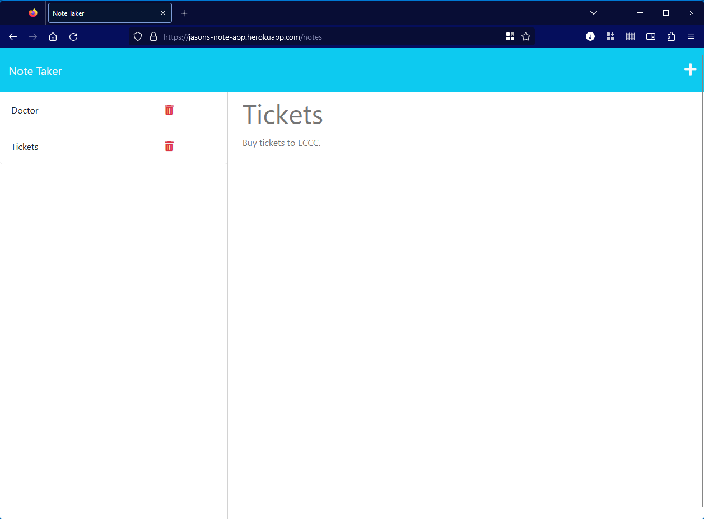

# NoteTaker

## Description

This project utilizes Node.js, Heroku, UUIDv4.js, Express.js, and the built-in 'fs' package to create a working Express.js server for a note-taking application. It was definitely a test of my abilities to create **working** routes using Express.js. The final result is deployed on a Heroku server.

## Table of Contents (Optional)

- [Installation](#installation)
- [Usage](#usage)
- [Credits](#credits)
- [License](#license)

## Installation

At the command prompt, type:
```
git clone git@github.com:error201/NoteTaker.git
``` 
to clone the repository. Navigate into the new folder and type:
```
npm install
```
to install the necessary npm packages.


## Usage

In a web browser, naviate to the page: [NoteTaker](https://jasons-note-app.herokuapp.com/notes).
Notes can be added by clicking on the `+` icon on the far right of the screen. Enter the title of the note as well as any details, and click on the `save` icon. Your note will appear in the list on the left. To view a note, select it from the list. To delete a note, click on the `trash` icon on the note in the list.


 


## Credits

Several packages and/or libraries were used for this project:
 - [Node.js](https://nodejs.org/en/)
 - [Express.js](https://expressjs.com/)
 - [UUID.js](https://www.npmjs.com/package/uuid)
 - [Heroku](https://www.heroku.com)

## License

This project is covered by the MIT license. Please see [LICENSE](./LICENSE) for details.


---

🏆 The previous sections are the bare minimum, and your project will ultimately determine the content of this document. You might also want to consider adding the following sections.

## Badges


## How to Contribute

Feel free to fork and/or clone this repository to contribute.
